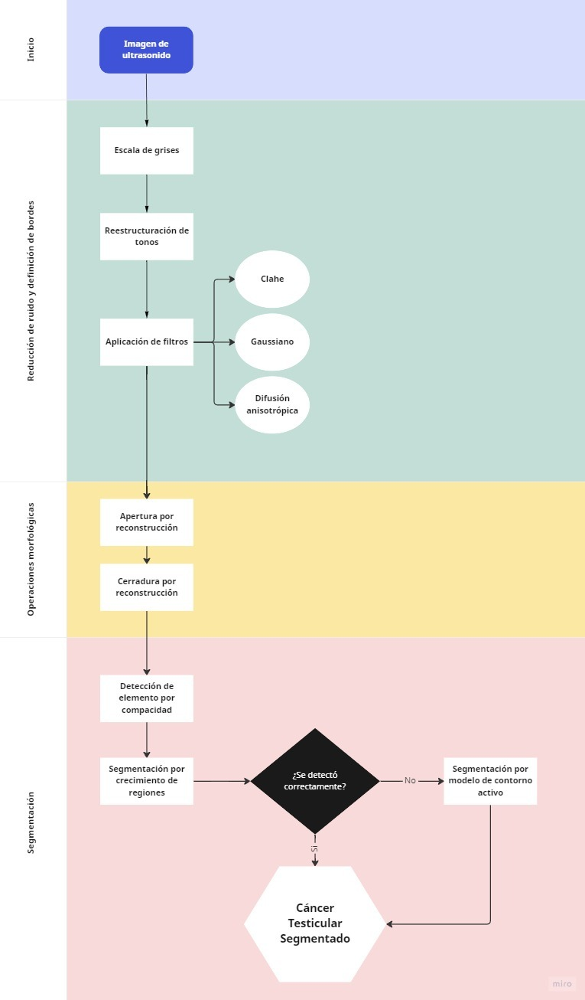

# Segmentador-de-cancer-testicular-2D
Segmentación de cáncer testicular utilizando imágenes de ultrasonido

Se utilizan técnicas y algoritmos como: 
- Reducción de ruido
- Aplicación de operaciones morfológicas
- Segmentación y detección del cáncer

